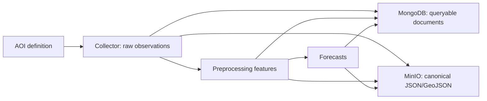
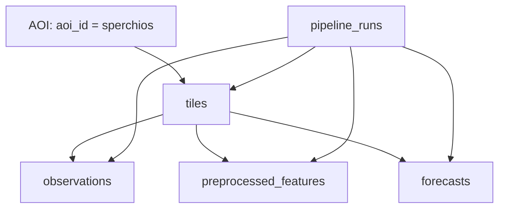

# TERRA UC1 Data Contract

This contract connects the standalone collector, the scheduled forecaster,
MongoDB, and MinIO. The collector writes local JSON/CSV staging artifacts. The
scheduled pipeline makes JSON/GeoJSON durable in MinIO and stores queryable
records in MongoDB.

## Stable identifiers

- Observation upsert key: `aoi_id + tile_id + observation_date`.
- AOI identity: stable `aoi_id` from `TERRA_AOI_ID`, plus an
  `aoi_definition_hash` calculated from the AOI bbox, CRS, and tile-generation
  parameters. `aoi_id` identifies a physical study area, not an environment
  label such as `dev` or `prod`.
- Dates: UTC calendar dates in `YYYY-MM-DD` format.
- Geometry: WGS84 bounding boxes and GeoJSON polygons.
- Schema version: `1.0.0`.

## Collector records

`history/global_history.json` is a local staging JSON array. The same rows are
also written to `history/global_history.csv` for compatibility. Each record
contains:

- Tile, observation date, bbox, timestamps, and collection attempt count.
- `collection_status`: `collected` when all seven metrics are available,
  otherwise `unavailable`.
- `collection_method: all_valid_pixels_v1`, identifying statistics collected
  without a water mask. Older `water_masked_legacy` rows are retained but
  replaced by upsert during backfill.
- `water_check_status: not_performed` and `water_status: unknown`; water
  eligibility is intentionally decided later by the forecasting pipeline.
- Source scene count, STAC item IDs, asset paths, quality flags, and the seven
  water-quality metrics: `CDOM`, `Chl_a`, `Color`, `Cya`, `DOC`, `Turb`, `WQI`.

Missing numeric values are JSON `null`, never `NaN`. Transport and
authentication failures are not converted into no-data records; they appear in
`failed_units` and remain eligible for retry. The forecaster may enrich copies
of records with evaluated water metadata, but it does not rewrite collector
history.

## Request and result

`CollectionRequest` is the producer input contract. `CollectionResult` reports
run status, discovered and selected dates, written records, retryable failures,
warnings, and paths to generated artifacts. The JSON representations are in
`data_collection/schemas/`:

- `collection-request.schema.json`
- `collection-result.schema.json`
- `collection-state.schema.json`
- `global-history.schema.json`
- `history-record.schema.json`
- `river-tiles.schema.json`

The current connector is local Python. A future HTTP service may use the same
request/result shapes without changing preprocessing or forecasting.

## Pipeline data flow



## MongoDB data model

MongoDB stores queryable records. Collections are connected by shared fields;
MongoDB does not enforce foreign keys.



| Collection | Purpose | Unique key |
|---|---|---|
| `tiles` | Stable AOI tile definitions and geometry metadata | `aoi_id + tile_id` |
| `observations` | Raw collector metrics for each tile and date | `aoi_id + tile_id + observation_date` |
| `preprocessed_features` | Model-ready features derived from observations | `aoi_id + tile_id + feature_date + preprocessing_schema_version` |
| `forecasts` | Forecast values by forecast cycle, tile, date, and step | `aoi_id + forecast_run_id + tile_id + forecast_date + step` |
| `pipeline_runs` | Execution status, warnings, and artifact manifest | `run_id` |

Common relationships:

- `aoi_id` identifies the physical study area across all collections.
- `tile_id` connects tiles, observations, features, and forecasts.
- `last_run_id` records which `pipeline_runs.run_id` last wrote a document.
- `forecast_run_id` groups forecast rows belonging to one forecast cycle.
- `aoi_definition_hash` verifies the same AOI definition and tile configuration.
- `artifact` is an optional MinIO pointer stored with observations, features,
  and forecasts.

## MinIO data structure

MinIO stores complete JSON, GeoJSON, STAC, and run artifacts. The `/`
characters are object-key prefixes, not filesystem directories.

```text
<bucket>/
└── terra-uc1/
    └── <aoi_id>/
        ├── aoi/
        │   ├── definition.json
        │   ├── collection_state.json
        │   ├── stac/
        │   │   ├── collection.json
        │   │   └── geometries.json
        │   └── tiles/
        │       ├── river_tiles.geojson
        │       ├── tile_records.json
        │       └── tile_state.json
        ├── observations/<observation-date>.json
        ├── preprocessed/features/<tile_id>.json
        ├── forecasts/<forecast_run_id>.json
        └── runs/<run_id>/
            ├── collection/
            ├── logs/
            ├── processing/
            ├── stac_catalog/
            └── scheduled_run_result.json
```

AOI files are stable and reused between runs. Observations, features, and
forecasts are canonical AOI data keyed by date or forecast cycle. Run prefixes
contain execution results, logs, processing state, STAC items, and provenance.

## MongoDB-MinIO relationship

MongoDB records may contain an `artifact` reference:

```json
{
  "bucket": "terra-uc1",
  "key": "terra-uc1/sperchios/observations/2026-06-06.json",
  "sha256": "...",
  "content_type": "application/json"
}
```

The `artifact.bucket` and `artifact.key` point to the corresponding MinIO
object. `sha256` verifies its content. This is a logical application
relationship, not an enforced cross-service foreign key.

CSV files remain local staging/compatibility outputs. JSON in MinIO and
structured MongoDB documents are the persistent data sources for preprocessing
and inference.
